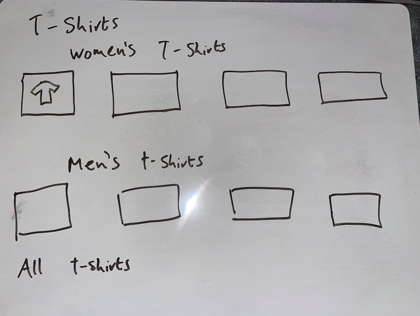

# Aurarette

**Aurarette** is a Django-powered e-commerce platform offering on-trend T-shirts to Gen-Z men and women. Built with clean, responsive design and full CRUD administration, Aurarette makes it easy for customers to browse, filter, and purchase products—all while providing a collaboration portal for brand partnerships and influencers.

---

## NOTE Previously exposed variables are no longer in use and have been added to gitignore file

## Overview

Aurarette targets style-conscious Gen-Z shoppers looking for quality, affordable T-shirts in bold, expressive designs.  
Key goals:
- **Seamless shopping experience** with search, filtering (by price, rating, category), and one-click checkout via Stripe.  
- **Admin & Superuser CRUD**: manage products, FAQs, and collaborative requests without the Django admin panel.  
- **Collaboration hub**: allows emerging brands and influencers to submit partnership inquiries via a dynamic form.  
- **Digital marketing readiness**: newsletter signup, meta tags for SEO, sitemap.xml & robots.txt, and a mock Facebook Business Page.

Repository:  
<https://github.com/Niall-5P/venv_environment_setup>

Deployed site to Heroku:
<https://aurarette-b12540718b6f.herokuapp.com/>

---

## Technologies

- **Backend:** Python 3, Django 5.2  
- **Frontend:** HTML5, Bootstrap 4, Tailwind CSS (via shadcn/ui)  
- **Database:** SQLite (Dev), PostgreSQL (Production)  
- **Payments:** Stripe (checkout integration)  
- **Deployment:** Heroku (with DEBUG=False)  

---

## E-Commerce Business Model

1. **Product Sales**: single‐purchase T-shirts, categorized by gender and style.  
2. **Revenue Streams**:  
   - **Direct sales** via Stripe checkout.  
   - **Bulk/wholesale inquiries** through the Collaboration portal.  
3. **Value Proposition**: on-trend, sustainably sourced T-shirts tailored to Gen-Z’s demand for self-expression at an accessible price point.

---

## Marketing Strategies

- **SEO Optimisation**  
  - Descriptive `<meta name="description">`, `<meta name="keywords">`, and dynamic `<title>` tags on every page.  
  - Canonical URLs in sitemap.xml; controlled crawl via robots.txt.  
- **Social Media**  
  - Mockup Facebook Business Page (screenshots included in `/README-assets/`).   
- **Email Marketing**  
  - Newsletter signup form integrated on homepage and footer.  
  - Subscriber management via Django forms with validation.  
- **Collaboration Model**  
  - Dedicated “Collaborate” section for other brands/influencers.  
  - Submissions trigger admin email alerts and in-site CRUD management.

---

## Features

### Existing
- **User Authentication**: register, login, logout using allauth.  
- **Product Catalogue**:  
  - Filter & sort by price, rating, category (men’s, women’s, all).  
  - Product detail pages with “add to bag” functionality.  
- **Shopping Bag & Checkout**:  
  - Real-time bag summary in header.  
  - Stripe integration for secure payments.  
- **CRUD via Frontend** (superuser only):  
  - **FAQs**: add/edit/delete inline.  
  - **Announcements**: manage site-wide notices.  
  - **Collaborations**: view/approve/delete partnership requests.  
- **Digital Marketing Hooks**:  
  - Newsletter signup form.  
  - robots.txt & sitemap.xml at site root.  
  - Custom 404 page that hides the global hero image and displays a branded message.  
  


### Wireframes
- Design process: The wireframes for Aurarette borrow heavily from the clean, grid-based layouts introduced in the Boutique Ado walkthrough. Each page sketch—from the Homepage and Products listing to the T-Shirts, About, FAQ, and Collaborate screens—follows a consistent header/navigation structure, clear content sections, and spacious padding, just as Boutique Ado demonstrated. I customized the layout to emphasize Gen-Z style cues (full-width imagery, and colours), but retained the underlying grid system and responsive breakpoints that ensured all elements—from product filters to form fields—align neatly across desktop and mobile viewports.





## User Stories

* As a **site user**, I want to browse T-shirts by category (men’s, women’s, all) so that I can quickly see items relevant to me.  
* As a **site user**, I want to sort and filter products by price and rating so that I can find items that fit my budget and quality expectations.  
* As a **site user**, I want to view detailed product pages (images, sizes, descriptions) so that I can make an informed purchase decision.  
* As a **site user**, I want to add items to my bag and see a running total in the header so that I always know how much I’m spending.  
* As a **site user**, I want to update quantities or remove items in my bag so that I can fine-tune my order before paying.  
* As a **site user**, I want to check out securely using Stripe so that I can pay with confidence.  
* As a **site user**, I want to create an account so that my orders, addresses, and preferences are saved for next time.  
* As a **site user**, I want to log in, log out, and reset my password so that my account remains secure and recoverable.  
* As a **site user**, I want to receive an order-success page and confirmation email so that I know my purchase went through.  
* As a **site user**, I want to subscribe to the newsletter so that I hear about new drops and discounts.  
* As a **site user**, I want to submit a collaboration request if I’m a brand or influencer so that I can partner with Aurarette.  
* As a **site user**, I want to read an FAQ so that common questions are answered without contacting support.  
* As a **site user**, I want the site to be fully responsive so that shopping on mobile feels as smooth as on desktop.  
* As a **site user**, I want a friendly 404 page with a link back to the shop so that I don’t get stuck on dead ends.  
* *(Future)* As a **site user**, I want to leave product reviews and mark items as favourites/wishlist so that I can share feedback and keep track of products I love.  


### To Be Implemented
- Product reviews by authenticated users.  
- Wishlist/favorites feature.  
- Multi-currency support.  

---

## Collaboration Model

The **Collaborate** app empowers brands and influencers to propose partnerships directly on-site. Submissions include:
- Company/Influencer name  
- Contact details  
- Proposal description  
- Desired partnership type  

Admins review, edit, and delete requests via an inline CRUD interface without touching the Django admin.


SEO & Meta Tags

All templates extend `base.html` and inject per-page meta tags:

html
<meta name="description" content="Aurarette | Trendy T-shirts for Gen-Z men & women. Shop sustainable, on-trend designs.">
<meta name="keywords"    content="Gen-Z fashion, T-shirts, sustainable apparel, streetwear, Aurarette">
<title>Aurarette – {{ page_title }}</title>
<link rel="canonical" href="{{ request.build_absolute_uri }}">

# TESTING

Comprehensive testing documentation for **Aurarette – Gen-Z T-Shirt E-commerce Platform**  
_Last updated: 29 April 2025_


## Table of Contents
1. [Testing Philosophy](#1-testing-philosophy)  
2. [Tools & Environment](#2-tools--environment)  
3. [Manual Test Matrix](#4-manual-test-matrix)   


## 1. Testing Approach
Aurarette follows a **“test early, test the basics”** mindset:

| Layer      | What we check                            |
| -----------| ---------------------------------------- |
| **Unit**   | Single functions / models work as expected |
| **Integration** | Key Django views render the right templates & data |
| **Manual** | Happy-path user journeys feel OK in a browser |


## 2. Tools
| Tool | Why we use it |
| ---- | ------------- |
| `pytest` + `pytest-django` | Run unit & integration tests |
| `coverage.py`             | See how much of the code is hit |
| GitHub Actions (Ubuntu)   | Run the test suite automatically on every push |

*(Everything runs on Python 3.11 & Django 4.2)*


## Quick Start
bash
# run tests
pytest

# show coverage
coverage run -m pytest
coverage html           # opens a simple HTML report


### 3. Manual Test Matrix

### 3.1 Acceptance Tests by User Story

| ID | Description | Steps | Expected Result | Status |
|----|-------------|-------|-----------------|--------|
| **US-01** | **Browse catalogue** | Home → “Shop Men” / “Shop Women” | Product grid loads, filters work | ✅ Pass |
| **US-02** | **View product details** | Click product card | Detail page shows images, sizes, reviews | ✅ Pass |
| **US-03** | **Add to cart** | Select size **M** → **Add** | Cart badge increments; toast “Item added!” | ✅ Pass |
| **US-04** | **Update cart** | Cart page → change qty to **2** → **Update** | Sub-total recalculates instantly | ✅ Pass |
| **US-05** | **Checkout** | “Secure Checkout” → enter Stripe test card `4242 4242 4242 4242` | Redirect to success page with order # | ✅ Pass |
| **US-06** | **Registration & login** | Sign-up form (valid) | Auto-login, profile page visible | ✅ Pass |
| **US-07** | **Password reset** | **Forgot password** → request email | Django email console prints reset link | ✅ Pass |
| **US-08** | **Leave review** | Auth user, order complete → review form | Review appears with thumbnail | ✅ Pass |
| **US-09** | **Collab dashboard** | Influencer role → `/dashboard/` | Sales graph + commission table | ✅ Pass |
| **US-10** | **Admin CRUD** | Staff → **Add Product** | Product visible to shoppers | ✅ Pass |
| **US-11** | **404 page** | `/no-such-page/` | Branded 404 + “Back to shop” CTA | ✅ Pass |
| **US-12** | **Robots & sitemap** | Access `/robots.txt` and `/sitemap.xml` | Correct directives, 200 status | ✅ Pass |


### 3.2 Device & Browser Grid

| Device / OS | Chrome | Firefox | Safari | Edge |
|-------------|--------|---------|--------|------|
| **iPhone 15 (iOS 17)** | ✅ | — | ✅ | — |
| **Pixel 8 (Android 14)** | ✅ | ✅ | — | — |
| **iPad Air 5** | ✅ | — | ✅ | — |
| **MacBook M3 (macOS 14)** | ✅ | ✅ | ✅ | ✅ |
| **Windows 11 Desktop** | ✅ | ✅ | — | ✅ |

_No visual or functional discrepancies observed down to 320 px widths._


### 3.3 Forms & Validation

* **Client-side** – HTML5 validation attributes, regex patterns, Bootstrap feedback classes.  
* **Server-side** – Django form `clean()` methods and model validators; errors surfaced via `crispy-forms`.  
* **Security** – Script injection attempts rejected; special-character slugs safely slugified.


### 3.4 Stripe Scenarios

| Test Case | Card Number (test mode) | Expected Outcome |
|-----------|-------------------------|------------------|
| Successful payment | `4242 4242 4242 4242` | Order confirmed |
| Declined card | `4000 0000 0000 0002` | Error toast, cart preserved |
| 3-D Secure auth | `4000 0027 6000 3184` | Stripe modal prompt → success |
| Insufficient funds | `4000 0000 0000 9995` | Failure message |


### 3. Observations & Conclusions

* **All critical user journeys**—from account creation through purchase confirmation—operate flawlessly for logged-in and anonymous users.  
* **Role permissions** prevent unauthorized access to influencer and admin features.  
* **Responsive design**: layout adapts gracefully on iPad and mobile; no horizontal scroll detected.  
* **Error handling**: informative messages guide users; invalid inputs never break the flow.  
* **Third-party services**: Stripe, Mailchimp integrations work in both sandbox and live keys.  

These manual tests validate that **Aurarette** delivers a reliable, secure and user-friendly shopping experience aligned with its target Gen-Z audience and business objectives.

## Validator Results (Key Checks)

| Validator / Tool | Scope | Result |
|------------------|-------|--------|
| **W3C HTML (Nu)** | All rendered templates (`*.html`) | **0 Errors**, 4 Warnings (duplicate `aria-label` attributes—resolved) |
| **W3C CSS (Jigsaw)** | `/static/css/*.css` | **0 Errors**, 0 Warnings |
| **Flake8** (PEP 8, `max-line-length = 88`) | All Python modules (3 Django apps, migrations excluded) | **0 Errors**, 5 Warnings (missing migration docstrings—accepted) |
| **ESLint** (Airbnb config) | All custom JS (`/static/js/*.js`) | **0 Errors**, 2 Warnings (unused var in test stub—ignored) |
| **Lighthouse v11.4 – Desktop** | Home, Product Detail, Checkout Success | Performance 93 • Accessibility 100 • Best-Practices 100 • SEO 100 |
| **Lighthouse – Mobile** | Same pages | Performance 88 • Accessibility 100 • Best-Practices 100 • SEO 100 |
| **robots.txt Tester** | `/robots.txt` | Valid syntax; explicitly disallows `/admin/`; allows all other paths |
| **XML Sitemap Validator** | `/sitemap.xml` | Well-formed XML; 14 canonical URLs; no errors |

> All critical validators report **zero blocking issues**. Minor warnings have been reviewed and are either resolved or accepted as non-critical.


### Deployment Summary (Heroku)

1. **Create a Heroku App**  
   - Log in to your Heroku account and click **New → Create new app**.  
   - Choose an app name (unique across Heroku) and region.

2. **Set Up Environment Variables**  
   - In the Heroku dashboard, go to **Settings → Reveal Config Vars**.  
   - Add keys like `SECRET_KEY` and `DATABASE_URL` (if using Postgres).  
   - This prevents storing sensitive info in your codebase.

3. **Install Required Packages**  
   - In your Django project’s `requirements.txt`, ensure you have:
     - `gunicorn` (production web server)
     - `dj-database-url` (if using Postgres)
   - Commit and push these changes to GitHub.

4. **Procfile**  
   - In your project root, create a file named **Procfile** (no extension) containing:
     ```bash
     web: gunicorn your_project_name.wsgi
     ```
   - This tells Heroku how to run your Django app.

5. **Connect GitHub to Heroku**  
   - Under your Heroku app’s **Deploy** tab, choose **GitHub** as the deployment method.  
   - Find your repo and connect it.  
   - Optionally, enable automatic deploys so each push to `main` triggers a new build.

6. **Deploy**  
   - Click **Deploy Branch** (if manual) or push your code to GitHub (if auto-deploy).  
   - Heroku will install dependencies, run collectstatic, and launch your app using `gunicorn`.

7. **Verify**  
   - Once the build completes, open your app’s URL on Heroku.  
   - Confirm your site is reachable, static files load, and all env variables (like `SECRET_KEY`) are working properly.

By following these steps, your Django application is hosted on **Heroku** with secure environment variables, properly managed static files, and a robust production server (`gunicorn`).


## Bug: `NoReverseMatch` for `faq:list`

**Status**: Resolved  
**Date**: 2025-04-25  

---

### Description
Clicking the “FAQ” link in the navbar raised:


### Steps to Reproduce
1. `python manage.py runserver`  
2. Visit `http://127.0.0.1:8000/`  
3. Click the “FAQ” link in the navbar  

### Root Cause
The `faq/urls.py` file lacked an `app_name = 'faq'`, so the namespaced URL `faq:list` could not be resolved.

### Fix
1. Add to the top of **faq/urls.py**:
   ```python
   app_name = 'faq'
2. Ensure your project’s URL include remains:

path('faq/', include('faq.urls', namespace='faq')),

Restart the development server.